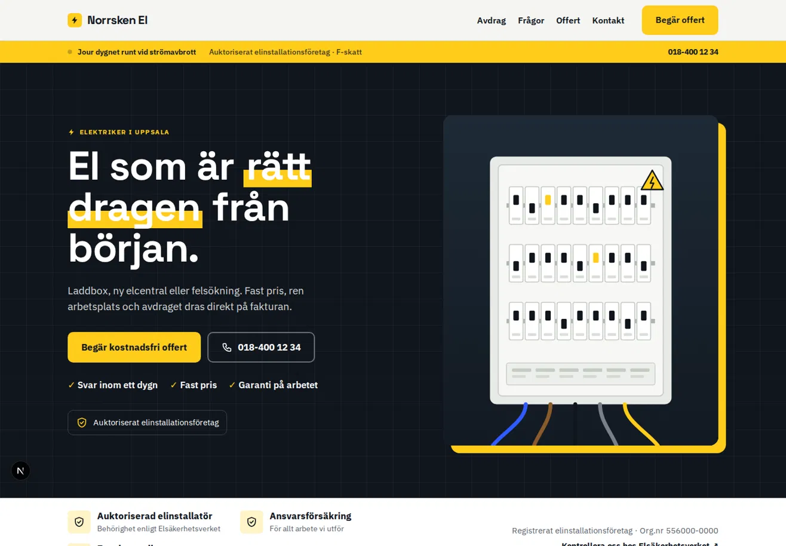
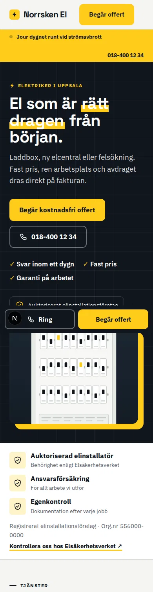
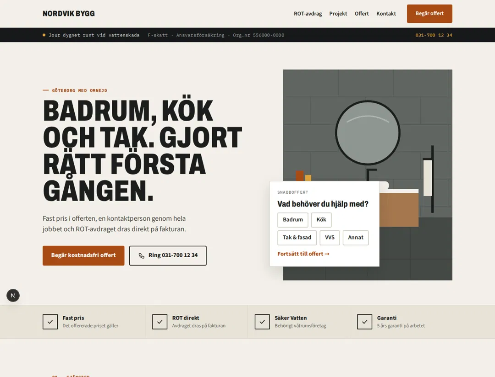
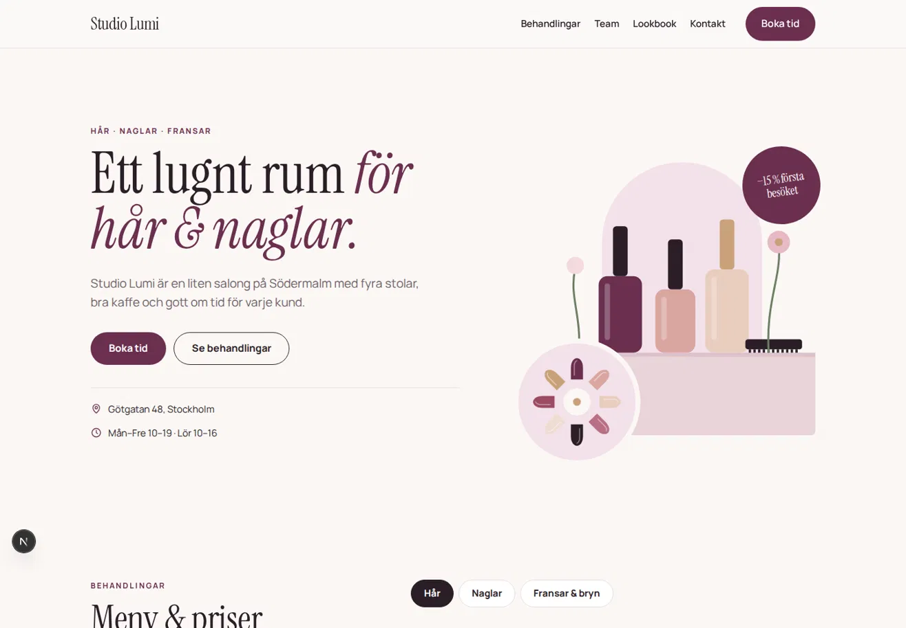
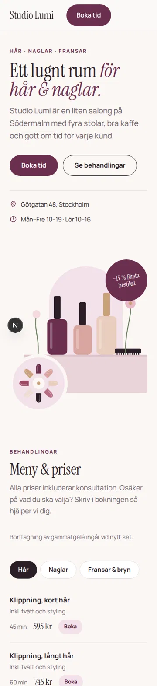
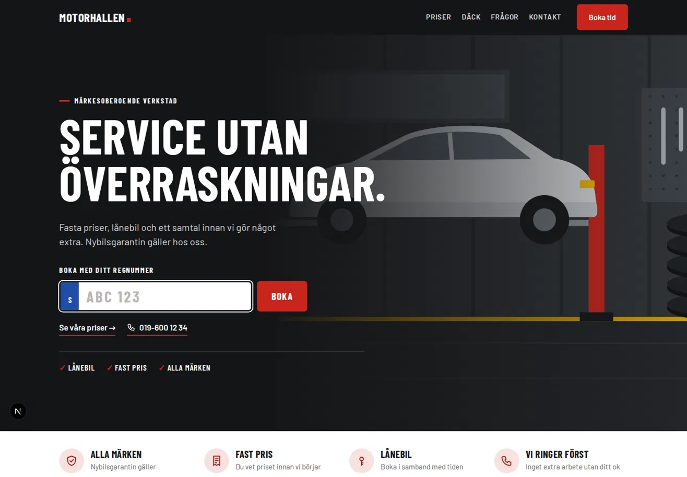
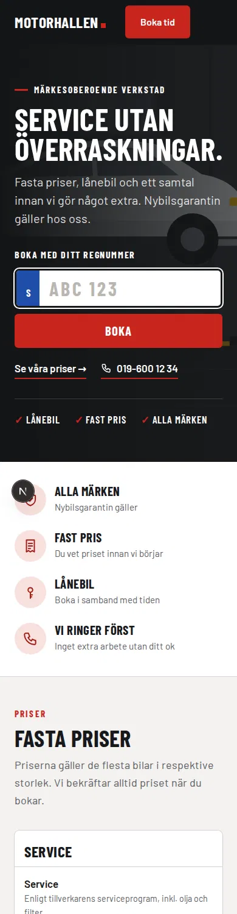

# Staark Themes

Reusable website themes built for fast project delivery, consistent quality and easy customization.


> **4 themes available**  
> Built as flexible starting points for real customer projects.

---

## 🎨 Theme Gallery

| Theme | Category | Style | Download |
| --- | --- | --- | --- |
| ⚡ **El** | Elektriker & elfirmor | Modern · Professional | [Download](./s-hub-el.zip) |
| 🛠️ **Hantverk** | Bygg & hantverk | Robust · Local | [Download](./s-hub-hantverk.zip) |
| ✨ **Skönhet** | Beauty & salonger | Elegant · Visual | [Download](./s-hub-skonhet.zip) |
| 🔧 **Verkstad** | Bil & fordonsservice | Technical · Direct | [Download](./s-hub-verkstad.zip) |

---

# ⚡ El


Ett modernt och professionellt tema för **elektriker, elinstallatörer och lokala elfirmor**.

Fokus ligger på tydlig presentation av tjänster, trygghet, lokalt förtroende och enkla vägar till offert eller kontakt.

### Desktop



### Mobile

<p align="center">
  
</p>

### Passar bra för

- Elinstallationer
- Felsökning
- Laddboxar
- Renoveringar
- Service & underhåll
- Företagsinstallationer

### Theme package

➡️ **[Download s-hub-el.zip](./s-hub-el.zip)**

---

# 🛠️ Hantverk


Ett stabilt och förtroendeingivande tema för **byggföretag, snickare, målare och andra hantverkare**.

Designen är gjord för lokala företag där tidigare projekt, tjänster och enkel kontakt är det viktigaste.

### Preview



### Passar bra för

- Bygg & renovering
- Snickeri
- Måleri
- Tak & fasad
- Markarbete
- Installation
- Lokala hantverksföretag

### Theme package

➡️ **[Download s-hub-hantverk.zip](./s-hub-hantverk.zip)**

---

# ✨ Skönhet


Ett elegant och visuellt tema för **frisörer, skönhetssalonger och beauty-verksamheter**.

Här ligger fokus på känsla, behandlingar, bilder och tydliga vägar till bokning.

### Desktop



### Mobile

<p align="center">
  
</p>

### Passar bra för

- Frisörsalonger
- Nagelsalonger
- Hudvård
- Fransar & bryn
- Massage
- Wellness
- Beauty studios

### Theme package

➡️ **[Download s-hub-skonhet.zip](./s-hub-skonhet.zip)**

---

# 🔧 Verkstad


Ett tekniskt och tydligt tema för **bilverkstäder, däckservice och fordonsföretag**.

Designen prioriterar tjänster, snabb kontakt och bokningsdrivande innehåll så att kunden snabbt förstår vad företaget erbjuder.

### Desktop



### Mobile

<p align="center">
  
</p>

### Passar bra för

- Bilservice
- Bilverkstad
- Däckservice
- Hjulskifte
- Reparationer
- Diagnostik
- Fordonsservice

### Theme package

➡️ **[Download s-hub-verkstad.zip](./s-hub-verkstad.zip)**

---

# 🚀 What's included?

Staark themes är tänkta som **startpunkter**, inte färdiga copy-paste-webbplatser.

Varje projekt bör anpassas efter kunden.

### Vanliga anpassningar

- Företagsnamn
- Logotyp
- Brand colors
- Typografi
- Hero content
- Tjänster
- Bilder
- Telefonnummer
- E-post
- Kontaktformulär
- Offertformulär
- CTA-knappar
- SEO metadata
- Local SEO
- Lokala landningssidor

---

# 📱 Responsive by default

Teman är byggda med både desktop och mobile i åtanke.

```text
Desktop
   ↓
Tablet
   ↓
Mobile
```

Målet är att varje tema ska kunna användas som en stabil grund utan att behöva byggas om från början för olika skärmstorlekar.

---

# 🔍 SEO Ready

Teman är förberedda för vidare SEO-anpassning.

Exempel:

- Metadata
- Page titles
- Meta descriptions
- Semantic structure
- Local SEO
- Service pages
- City landing pages
- Internal linking
- Performance optimization

SEO-innehåll ska alltid anpassas efter kundens företag, tjänster och geografiska område.

---

# 📦 Repository structure

```text
avaible-themes/
│
├── previews/
│   ├── el-home.webp
│   ├── hub-el-mobile.webp
│   ├── hantverk.webp
│   ├── skonhet-home.webp
│   ├── skonhet-mobile.webp
│   ├── verkstad-home.webp
│   └── verkstad-mobile.webp
│
├── s-hub-el.zip
├── s-hub-hantverk.zip
├── s-hub-skonhet.zip
├── s-hub-verkstad.zip
│
└── README.md
```

---

# ➕ Adding a new theme

När ett nytt tema skapas:

### 1. Theme package

Lägg ZIP-filen direkt i `avaible-themes/`.

Namngivning:

```text
s-hub-<category>.zip
```

Exempel:

```text
s-hub-restaurang.zip
s-hub-tandlakare.zip
s-hub-stadfirma.zip
```

### 2. Preview images

Lägg screenshots i:

```text
avaible-themes/previews/
```

Rekommenderad namngivning:

```text
<category>-home.webp
<category>-mobile.webp
```

### 3. Update this README

Lägg till:

- Theme name
- Preview
- Short description
- Target industry
- Use cases
- Download link

---

# 💡 Planned themes

Future theme ideas:

| Theme | Industry | Status |
| --- | --- | --- |
| 🍽️ Restaurang | Restauranger & caféer | Planned |
| 🧹 Städ | Städfirmor | Planned |
| 🦷 Tandläkare | Dental clinics | Planned |
| 🏠 Fastighet | Fastighetsföretag | Planned |
| 🌿 Trädgård | Landscaping | Planned |
| 🚚 Transport | Transportföretag | Planned |

---

# Staark Inc.

**Build once. Adapt fast. Deliver better.**

Reusable foundations for faster websites without sacrificing quality.
